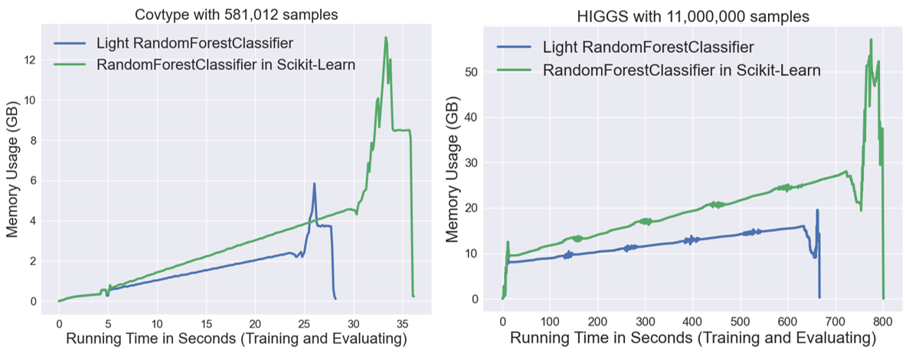

# Light Random Forest
 Experimental Random Forest for Extremely Large Dataset based on Scikit-Learn.

## Background
Random Forest (RF) implemented in Scikit-Learn is arguably the most efficient implementation we have now.

However, its training costs are still prohibitively large on extremely large datasets. For instance, more than 50GB memory is required in order to fit a `sklearn.ensemble.RandomForestClassifier` with only 100 estimators on the HIGGS dataset with around 10 million samples.

This project contains a reduced implementation of decision tree/random forest in Scikit-Learn, which has much smaller training costs than the original implementation in Scikit-Learn, especially in terms of the memory usage. To achieve this, some basic ideas are:
* Implement classic teachniques on accelerating decision tree, e.g., data binning ;
* Remove properties irrelevant to the model inference on decision tree, e.g., feature importance ;
* Simplify the underlying data structure of decision tree.

## Experiment Results
* **Covtype Dataset**
    * 581,012 samples | 54 features
    * n_estimator=500 | n_jobs=-1 | Remaining hyper-parameters are set to their default values
* **HIGGS Dataset**
    * 11,000,000 samples | 28 features
    * n_estimator=100 | n_jobs=-1 | Remaining hyper-parameters are set to their default values
* **More Results**
    * Each numerical cell in the table below denotes the results of LightRF / Scikit-Learn RF, respectively.
    * Curves in the figure below are reported by Memory Profiler (https://github.com/pythonprofilers/memory_profiler)

|      Metric Name    |   COVTYPE   |     HIGGS     |
|:-------------------:|:-----------:|:-------------:|
|   Testing Acc (%)   | 73.74/73.74 |  75.86/75.86  |
|   Model Size (GB)   |  1.45/4.02  |   5.31/18.67  |
|  Training Time (s)  | 19.87/25.46 | 653.47/749.10 |
| Evaluating Time (s) |  1.56/1.90  |   3.01/4.77   |

